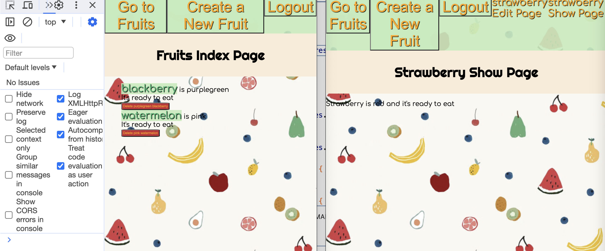

```HTML
<!DOCTYPE html>
<html lang="en">
<head>
     <meta charset="UTF-8">
     <meta http-equiv="X-UA-Compatible" content="IE=edge">
     <meta name="viewport" content="width=device-width, initial-scale=1.0">
     <link rel="stylesheet" href="/css/app.css"/>
     <title>Welcome to the Jungle</title>
</head>
<body>
     
</body>
</html>
```

<<<<<<< HEAD
# Revisit and Update

I've been going through apps and making notes about where they may be useful. In particular, I'd like to highlight that this app separates the CRUD functionality into different pages. All of the MERN apps combine all of the functions into a single page. So I wanted to explore the show page. 

Overall I love this app!



## Annotations


=======
### Updates

## Annotations
>>>>>>> 7d3219df5ca65a7fa48477173f6291183e5fd43a
